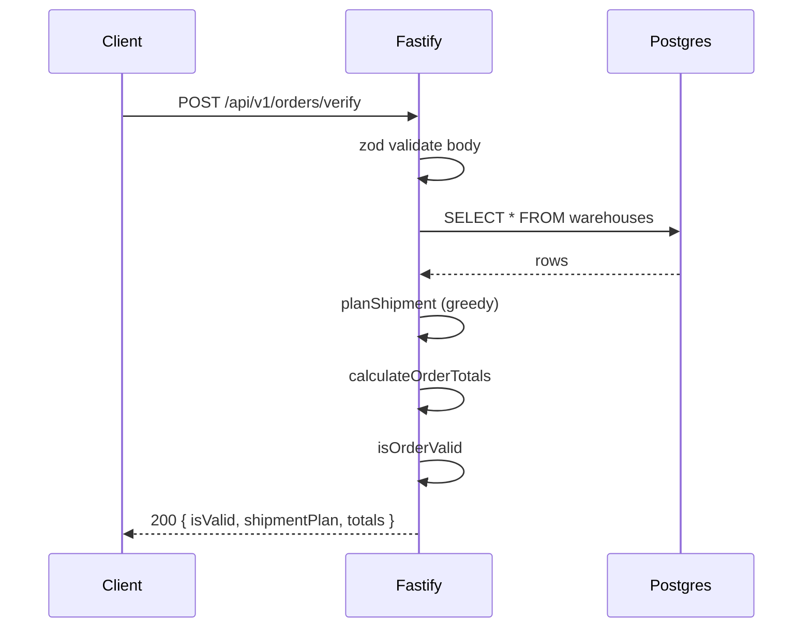
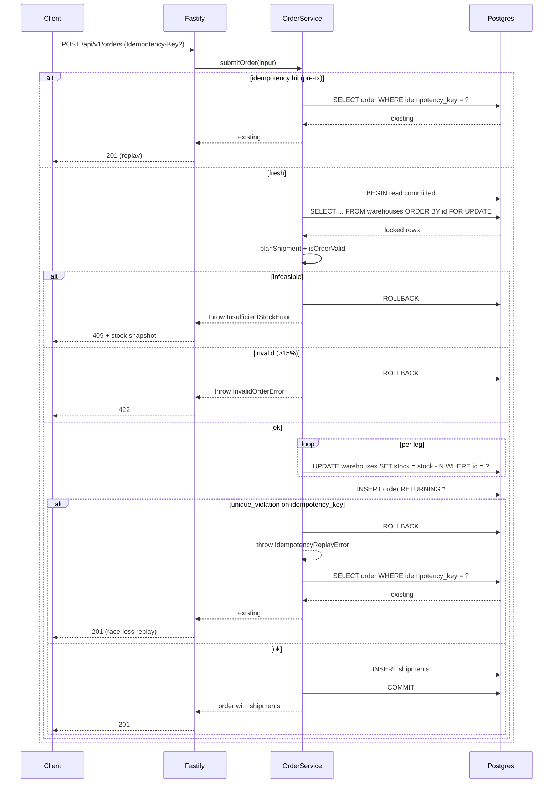
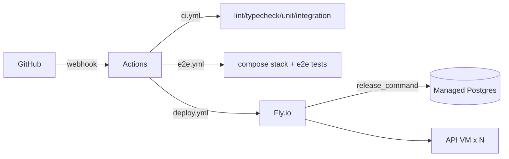

# Architecture

A deeper look at the request lifecycles, failure modes, and the data flow
behind the ScreenCloud OMS backend. Read alongside the README and
[`IMPLEMENTATION_SPEC.md`](./IMPLEMENTATION_SPEC.md).

## Request lifecycle: verify



Verify is stateless and read-only. The plan it returns is a "best-effort
snapshot" — it can be invalidated by another submit landing in the
millisecond between verify and submit. The submit transaction is the
authoritative gate.

## Request lifecycle: submit



## Failure modes

| Failure | Detection | Behavior |
|---|---|---|
| DB unreachable on verify | exception in select | 500 INTERNAL_ERROR (Fastify error handler) |
| DB unreachable on submit | exception in tx open | 500 INTERNAL_ERROR; tx never started, no partial state |
| Stock decremented to negative | CHECK constraint `stock >= 0` | tx rolls back; client gets 500 (invariant violation — should be impossible because of FOR UPDATE re-plan) |
| Concurrent submit wins the race | re-plan returns infeasible | 409 with snapshot of current stock |
| Concurrent submit with same idempotency-key | unique_violation on insert | caught, sentinel thrown; outer scope re-reads existing order; 201 (replay) |
| Invalid input | zod validation in route | 400 BAD_REQUEST |
| Idempotency-Key replay (pre-tx hit) | existence check before tx | 201 with original payload, no decrement |
| Migration mid-deploy | release_command fails | Fly halts the release; old version stays serving |
| Pool error from idle pg client | `pool.on('error')` handler logs | logged via stderr; process keeps running |
| Smoke test fails after deploy | curl to /ready times out | `flyctl releases rollback` triggered automatically |

## Data flow

```mermaid
flowchart TD
  req[HTTP request] -->|zod| route[route handler]
  route --> domain[pure domain functions]
  route --> service[order-service]
  service -->|drizzle .for('update')| pg[(postgres)]
  domain --> route
  service --> route
  route --> resp[HTTP response]
```

The pure domain layer is dependency-free (zero imports of zod, drizzle, fastify).
The service layer composes domain functions inside a transaction. Routes are
thin: validate, dispatch, format. Errors propagate as typed domain errors
(`InsufficientStockError`, `InvalidOrderError`, `NotFoundError`) which the
central error handler in `app.ts` maps to HTTP status codes.

## Locking timeline (concurrent submits)

```
t=0    Tx A   BEGIN; SELECT ... FOR UPDATE  (acquires locks on all 6 warehouse rows)
t=0    Tx B   BEGIN; SELECT ... FOR UPDATE  (waits on Tx A's locks)
t=10   Tx A   plan ok, decrements, INSERT order, INSERT shipments, COMMIT
t=10   Tx B   acquires locks; re-plans against now-decremented stock
t=10   Tx B   if insufficient, ROLLBACK + 409; else proceeds
```

Because both transactions request locks in the same id order
(`ORDER BY id ASC FOR UPDATE`), classic AB/BA deadlocks are impossible:
they always queue on the same first-locked row.

## Idempotency-key race timeline

The pre-tx existence check is not a guarantee — two concurrent calls with the
same key can both miss it:

```
t=0    Tx A   no existing order with this key (pre-tx check)
t=0    Tx B   no existing order with this key (pre-tx check)
t=1    Tx A   BEGIN; lock; insert order with key K
t=1    Tx B   BEGIN; lock (waits); ...
t=2    Tx A   COMMIT — key K now persisted
t=3    Tx B   acquires locks; planShipment ok; UPDATE stock; INSERT order with key K
                → unique_violation (SQLSTATE 23505)
t=3    Tx B   catch; throw IdempotencyReplayError(key=K); ROLLBACK
t=4    Tx B   outer scope re-reads order by key K; returns existing
t=4    Client B receives the same 201 response Client A got
```

Key invariants:
- Tx B's stock decrements are rolled back (the unique_violation aborts the
  transaction). Net effect: stock decremented exactly once, both clients get
  the same response.
- The outer-scope re-read is necessary because `tx` cannot be reused after
  a constraint violation aborts it.

## Why `read committed` (not `serializable`)

`read committed` is the Postgres default and is safer than naming a stronger
isolation level than necessary. The submit transaction's correctness rests
on the explicit row locks acquired by `SELECT ... FOR UPDATE`, not on the
isolation level. Once those locks are held:

- Other tx that try to read or write the same rows block (or skip them with
  `FOR UPDATE SKIP LOCKED`, which we don't use).
- The mutated rows behave serializably with respect to other locking readers.
- Rows we don't read aren't part of our consistency guarantee — but we don't
  need them to be (verify is read-only, submit only mutates the rows it locked).

`serializable` would add predicate locks (more overhead) without changing
the guarantees on the rows we actually mutate.

## Test layering

| Layer | Location | Purpose |
|---|---|---|
| Unit | `apps/api/test/unit/` | Pure domain functions (rounding, distance, pricing, planner, validator, errors). 100% line + branch + function coverage enforced. 47 tests. |
| Integration | `apps/api/test/integration/` | Real Postgres via testcontainers. Routes, services, transactional behavior, idempotency, concurrency stress (50 iterations on CI). 17 tests. |
| E2E | `apps/api/test/e2e/` | Black-box HTTP via undici against the running compose stack. Verify, submit-flow, idempotency. 4 tests. |

## Deployment topology



- **Preview deploys per PR:** ephemeral `scos-oms-pr-<N>` app + dedicated
  Postgres. Cleaned up on PR close.
- **Production:** `scos-oms-prod`. `release_command` runs migrate + seed
  on a one-shot machine before traffic shifts. Auto-rollback if smoke test
  to `/api/v1/ready` fails.
- **Image:** multi-stage Dockerfile, runtime is `node:20-bookworm-slim`
  with `USER node` hardening. ~84 MB content layer.
