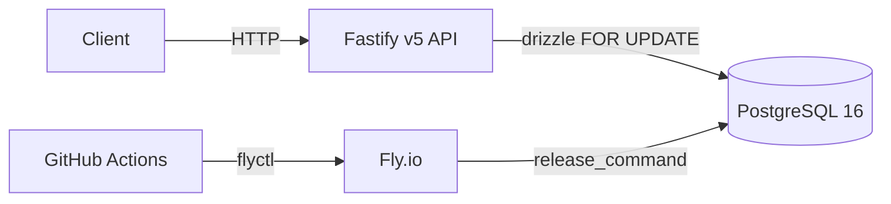

# ScreenCloud OMS — Backend

Backend service for ScreenCloud's sales-team Order Management System. Implements
order verification and atomic order submission across 6 global warehouses, with
pessimistic row-locked inventory decrements.

## Live demo
- Production: https://scos-oms-prod.fly.dev
- API docs:   (Swagger UI at `/docs` is gated to non-production; in prod the JSON spec is available at `/documentation/json`)

## Quick start

```
docker compose up
# API on http://localhost:3000
# Swagger UI at http://localhost:3000/docs
```

## Architecture



The API is a Fastify v5 service. Domain logic (distance, pricing, planning,
validation, rounding) lives in a pure-function `domain/` layer with 100%
test coverage. The transactional submit lives in `services/order-service.ts`
and uses Drizzle's first-class `SELECT ... FOR UPDATE` to lock all warehouse
rows in deterministic order before recomputing the plan and decrementing stock
in a single transaction.

## Key technical decisions

### Backend-only scope (per the brief)
The challenge scopes work to the backend. Auxiliary `GET /orders` and
`GET /warehouses` endpoints are kept as documented future hook points so a UI
can be added later without re-shaping the API contract.

### Why Fastify over Express
TypeScript-first; built-in schema validation; `fastify-type-provider-zod` gives
us OpenAPI generation from the same zod schemas a frontend would consume.

### Why Drizzle over Prisma
Atomic inventory decrements need `SELECT ... FOR UPDATE`. Drizzle exposes it
as a typed `.for('update')` call; Prisma only via `$queryRaw` (no types on
the locked rows). This is the deciding factor for the ORM choice.

### Greedy shipment planner
Per-unit shipping cost is constant per warehouse (`distance × 0.365 kg × $0.01/kg/km`),
no fixed per-shipment costs and no quantity-tiered rates. Greedy-by-distance
is therefore provably optimal — each marginal unit goes to its cheapest
available warehouse. `O(W log W)` where W=6.

### Money in integer cents (banker's rounding)
Floats forbidden for money. Banker's rounding applied at calculation
boundaries to avoid half-up bias accumulation across orders.

### UUID order numbers
Globally unique, non-enumerable, no central sequence required. `id` (internal
PK) and `orderNumber` (external) are kept separate so the externally-visible
identifier can evolve without disturbing FKs.

### Concurrency model
Pessimistic row locking with deterministic warehouse-id ordering to prevent
deadlocks. The plan is recomputed against locked rows since the verify-time
plan may be stale. `read committed` isolation is sufficient because the row
locks give us serializable behavior on the rows we modify. The integration
suite includes a 50-iteration concurrency stress test (`Promise.allSettled`
of two parallel `submitOrder` calls competing for the same constrained
stock; asserts exactly one wins, verifies single-decrement, no deadlocks).

### Idempotency-Key
Production-grade addition not required by the brief. Pre-tx existence check
short-circuits replays. Unique-violation race (two concurrent submits with
the same key both passing the pre-tx check) is caught and re-read so callers
always get the original order back — never a 500.

### Shared zod schemas
The `packages/shared` workspace defines all request/response shapes once.
Today the API consumes them for validation and OpenAPI generation; tomorrow
a frontend consumes the same package — the GET endpoints are typed end-to-end.

## CI/CD

Three workflows in `.github/workflows/`:

- **`ci.yml`** — lint, typecheck, unit, integration. The concurrency stress
  test runs 50 iterations.
- **`e2e.yml`** — boots `docker-compose.e2e.yml`, polls `/ready`, runs
  e2e suite, dumps logs, tears down.
- **`deploy.yml`** — every PR gets an ephemeral preview app on Fly.io with
  its own DB; merges to `main` deploy production with `release_command`-gated
  migrations and post-deploy smoke testing (auto-rollback on failure). PR
  close cleans up preview infrastructure.

Migrations run via Fly's `release_command` — never on app boot. App startup
assumes the schema is already current.

## Production concerns

- **Consistency:** pessimistic row locks via `.for('update')`, deterministic
  ordering by warehouse id (deadlock-free), re-plan inside transaction.
- **Performance:** indexed by `created_at`, `idempotency_key`, `order_number`;
  planner is `O(W log W)`. Submit holds 6 row locks for ~10 ms typical.
- **Scalability paths:** optimistic versioning + retry, sharded inventory
  rows for higher contention, read-replica routing for GETs.
- **Extensibility:** product hardcoded in `UNIT_PRICE_CENTS`/`UNIT_WEIGHT_KG`
  constants. Multi-product is a `products` table + `product_id` FK +
  signature change in the domain functions — schema migration, not a rewrite.

## Testing

- `npm test` — unit + integration with coverage thresholds enforced.
- `npm run test:e2e` — black-box e2e against docker-compose stack.
- Coverage thresholds: 100% on `domain/`, 95% on `services/`, 90% on `routes/`.
- 47 unit tests + 17 integration tests + 4 e2e tests (68 total) all pass.

## What I'd do next (with more time)

- **Optimistic locking alternative.** Replace pessimistic FOR UPDATE with a
  version column + retry on conflict for higher throughput at scale.
- **Outbox pattern.** Publish OrderCreated events for downstream systems
  (fulfillment, analytics, accounting) with at-least-once guarantees.
- **Caching.** Redis cache for the warehouse list with cache invalidation
  on stock changes.
- **Rate limiting & auth.** Currently the API is open. Add auth (JWT or
  session) and per-rep rate limits.
- **Observability.** OpenTelemetry traces across verify/submit, structured
  pino logs with request IDs, Prometheus metrics on shipping-rejection rate
  and per-warehouse fulfillment frequency.
- **Property-based tests** on the planner via fast-check.
- **Carrier integration.** Replace the flat $0.01/kg/km rate with real
  carrier APIs (FedEx, DHL); turn the planner into a min-cost flow problem.
- **Admin endpoints** for stock adjustment, manual order overrides, refunds.
- **Frontend** consuming the typed GET endpoints already in place.
- **Multi-product support.** Currently hardcoded to one SKU; the schema
  generalizes cleanly to a products table with per-SKU weight/price.
- **Migrate to Fly Managed Postgres** (`fly mpg`) — current deploy uses
  legacy unmanaged Postgres which Fly is deprecating.

## Submission

- **Repository:** https://github.com/larkincrain/warehouse-solution
- **Live deploy:** https://scos-oms-prod.fly.dev
- **Email:** imogen.king@screencloud.io
